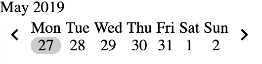

# \<date-carousel\>



This is a web component for picking a date in a carousel format. Scrolling through dates changes the week in focus. To learn about usage, check out the tests in `test/date-carousel_test.js`.

## Install into your app

If you are using a javascript bundler like Webpack or Rollup, npm install the module and import it in your JS/TS code.

```
npm install --save date-carousel
```

```
import 'date-carousel/date-carousel.js'
```

## Usage
```
<date-carousel (on-week-change)="onWeekChange($event)" (on-day-pick)="onDayPick($event)"></date-carousel>
```
```
<date-carousel useEthiopianCalendar (on-week-change)="onWeekChange($event)" (on-day-pick)="onDayPick($event)"></date-carousel>
```

### Attributes
- `weekInView`: The ISO string (yyyy-mm-dd) of value of the first day of the current week.
- `weekUnixValue`: The unix timestamp value in seconds of the first day of the current week.
- `datePicked`: The ISO string (yyyy-mm-dd) of value of the currently selected day. 
- `dateUnixValue`: The unix timestamp value in seconds of the currently selected day. 

**NOTE**
Unix timestamp values do not contain timezone or daylight savings information. Use them wisely.

### Events
- `on-day-picked`: When a user selects a day in the carousel, the attributes `datePicked` and `dateUnixValue` are updated and the event is dispatched.
- `on-week-change`: When users move forward or back in the date carousel, the attributes `weekInView` and `weekUnixValue` are updated and the event is dispatched.

### Styling
See CSS variables in the style tag of the component.

## Develop / Demo
```
git clone ...
cd ...
npm install
npm start
```

### Running Tests

```
git clone ...
cd ...
npm install
npm start
```


## Credits
This component is built using [Lit Element](https://github.com/Polymer/lit-element) for the [Tangerine Project](https://github.com/tangerine-community/tangerine).
